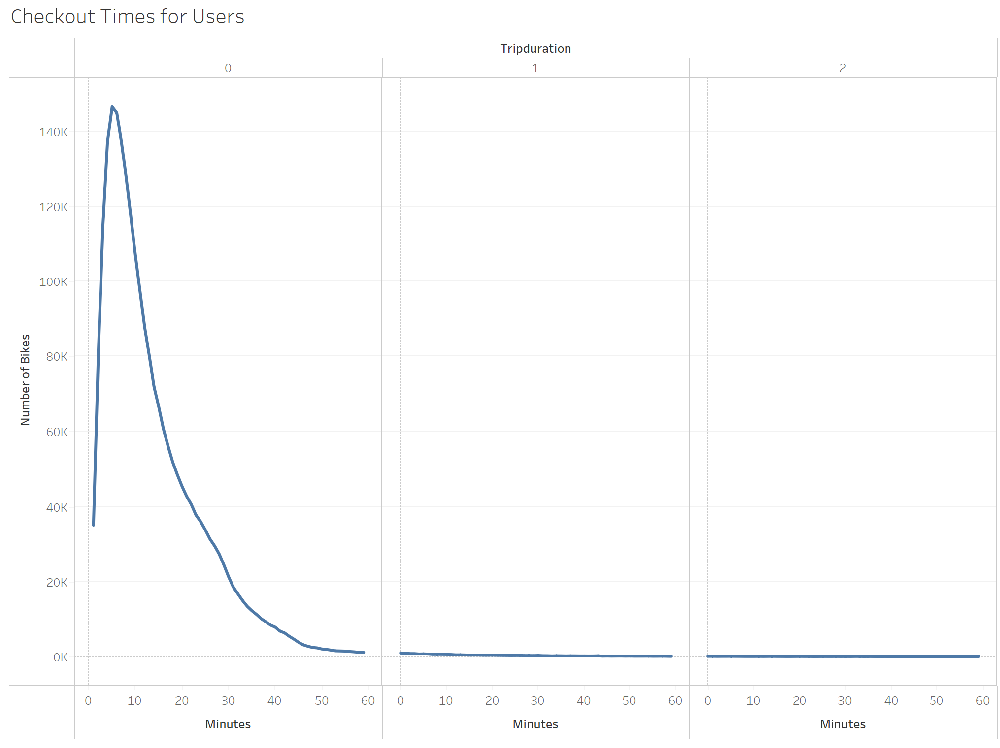
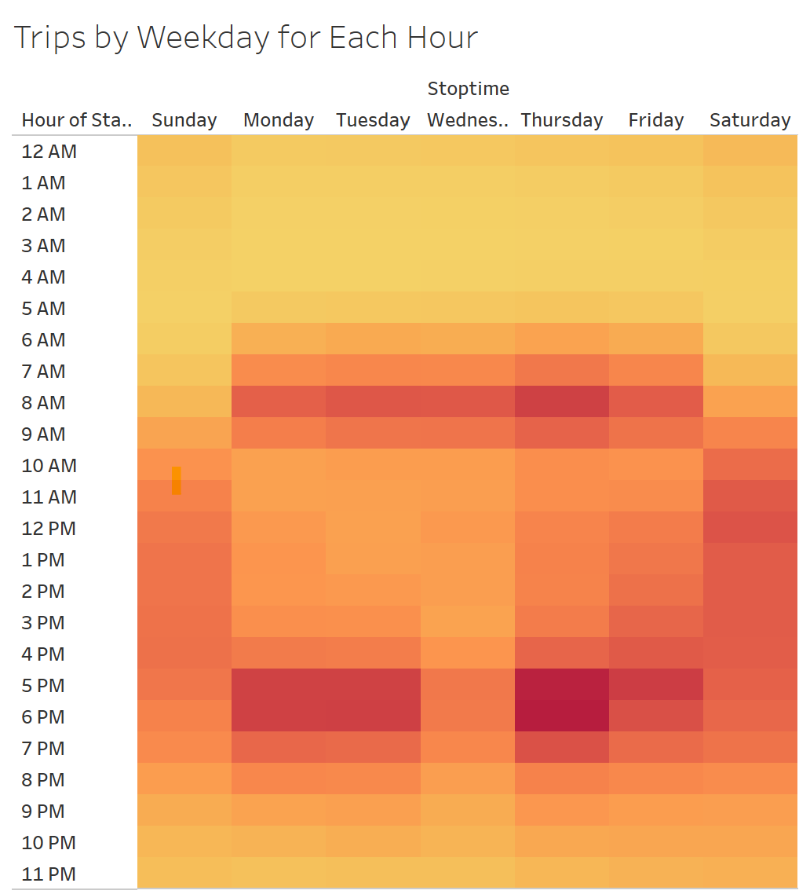
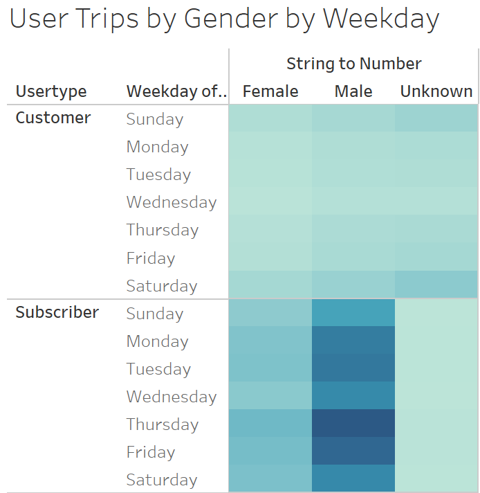

# Bikesharing in New York City

Dashboard link: https://public.tableau.com/views/CitibikeChallenge_16332889015430/Dashboard1?:language=en-US&:display_count=n&:origin=viz_share_link

## Overview of the analysis

During a summer trip to New York, my friend and I used Citi bike to move around the city. We used it to go to historical landmarks, museums, and to go to restaurants. That was akey component for us to really get to know the city. That started our idea of starting a bike sharing business in our hometown, Des Moise. After doing some brainstorming, we got to the conclusion that before analyzing if it would be a good idea for Des Moise, we should analyze how it works in New York. From there, we can make a more realistic informed decision on how if would work in Des Moise. We decided to use Citi Bike data that has been released to the public for your analysis.

## Results
By analyzing the start trip time and end trip time, we can see for how long users are riding the bikes. According to the data provided by citi bike, users are riding for an average of 10 - 30 mins per trip

From Monday - Friday, the bikes are most used from 7AM - 9AM and from 5 PM - 8 PM. That would indicate that people use it for their commute to work/school. During the weekends, the bikes are mostly used from 10 AM - 5 PM. 

This next visualization shows how many users are subscribers vs. customers. It also breaks it down by Gender. It is clear from the visualization that mostly males have a subscription and are regular users of Citi Bike. 

## Summary: Provide a high-level summary of the results and two additional visualizations that you would perform with the given dataset.
Based on the data we got from Citi Bike, male subscribers use the bikes the most during commute hours. Each trip is around 10 - 30 mins. 
It would be beneficial to start analyzing how Des Moise compares to New York City. We would need data to show how much tourism we get in Des Moise. It would also be beneficial to have data around how many people commute to work and if the streets suitable for bikes. 
